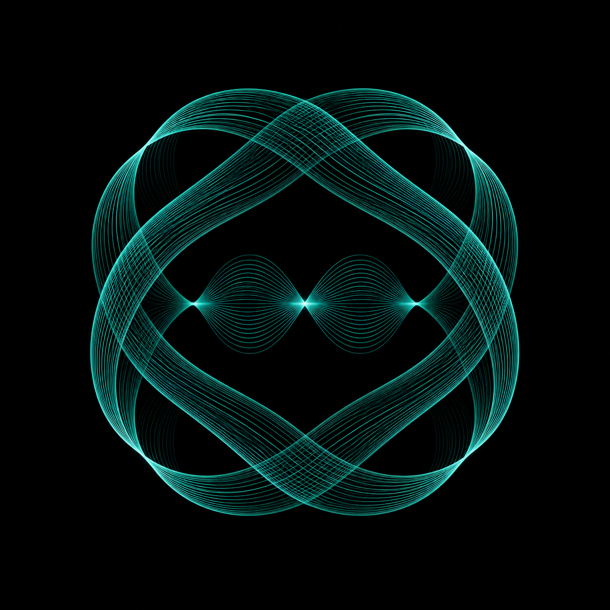
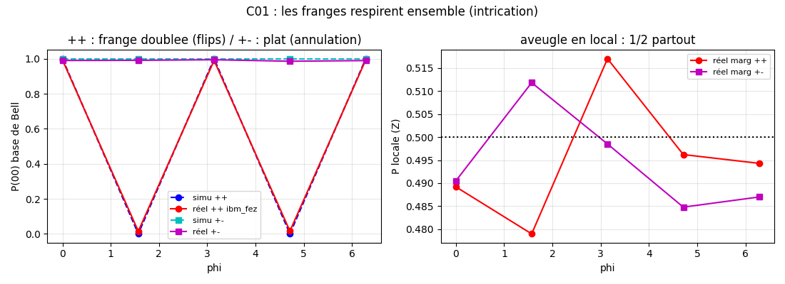
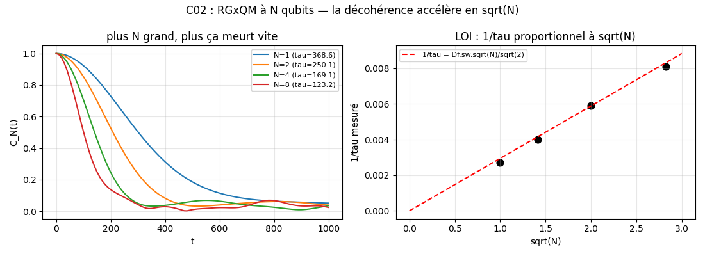
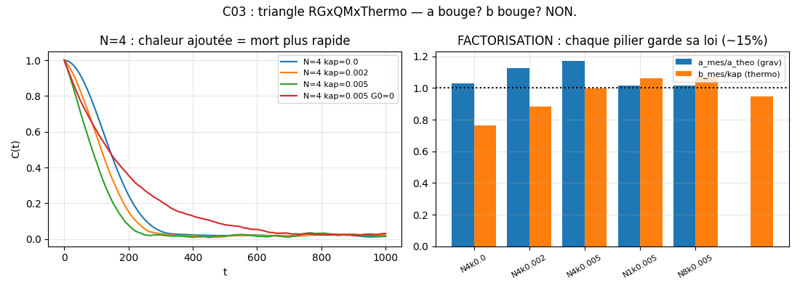
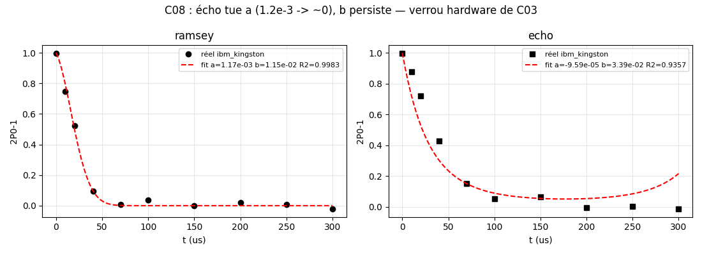
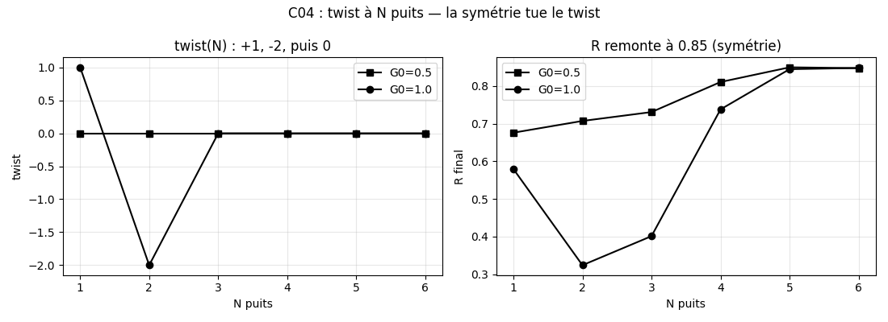
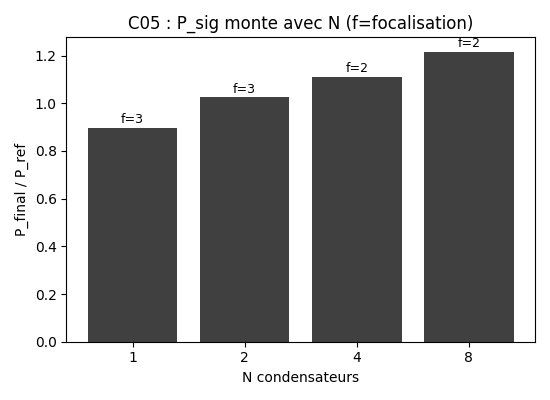
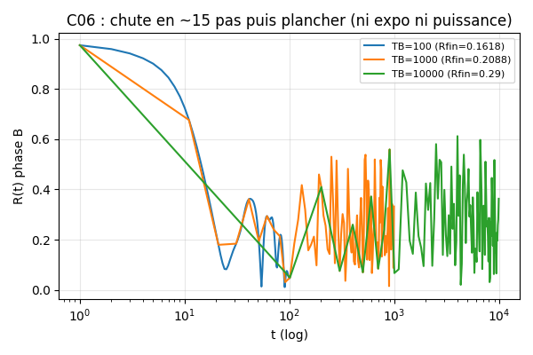
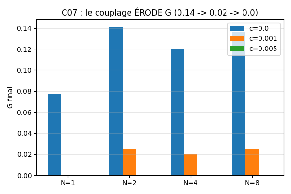
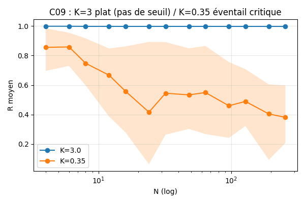

<div align="center">



# 🌌 RATISS CONTINUUMS — le simulateur du tissu

**Qiskit simule des amplitudes. Nous, on simule le tissu : cohérence topologique,
décohérence thermodynamique, couplage GR×QM, géométrie.**

[](LICENSE)
[](PROTOCOLES.md)
[](PROTOCOLES.md)
[](organes/)
[](organes/)

*Par **RATISS Labs** — Jonathan Evina · Licence MIT · Reproductibilité publique totale*

</div>



> **Abstract (EN).** *Other simulators evolve amplitudes; RATISS-CONTINUUMS simulates the
> fabric: topological coherence, thermodynamic (ETH) decoherence, GR×QM coupling, and
> geometric phase. Nine pre-registered tests (C01–C09), two IBM-QPU locks: entangled-2-qubit
> Berry fringes living only in correlations (locally blind, jointly fringed), gravitational
> decoherence scaling as 1/τ ∝ √N, RG×QM×Thermo factorisation (R² > 0.9996) hardware-locked
> by Ramsey-vs-echo, twist death under symmetric wells, P_sig growth with converging
> capacitors, memory floor (neither exp nor power), interaction-driven G erosion, and a
> critical finite-size fan with no sharp threshold. Every law ships with its test.
> Failures are published, never hidden. MIT.*

---

## 📖 Sommaire

1. [La question](#-la-question)
2. [Les trois couches : moteur, coupleurs, seuils](#-les-trois-couches--moteur-coupleurs-seuils)
3. [Résultats majeurs (données réelles)](#-résultats-majeurs-données-réelles)
4. [Méthode : rigueur héritée](#-méthode--rigueur-héritée)
5. [Architecture du dépôt](#-architecture-du-dépôt)
6. [Démarrage rapide](#-démarrage-rapide)
7. [Carte des 9 tests](#-carte-des-9-tests)
8. [Ce que ça ouvre](#-ce-que-ça-ouvre)
9. [Lire dans l'ordre](#-lire-dans-lordre)
10. [C01 : Berry à 2 qubits (piste interdite)](#-c01--berry-à-2-qubits-piste-interdite)
11. [C02 : loi d'échelle en racine de N](#-c02--loi-déchelle-en-racine-de-n)
12. [C03 : le triangle factorise](#-c03--le-triangle-factorise)
13. [Rafale C04-C09 : six tests d'un coup](#-rafale-c04-c09--six-tests-dun-coup)
14. [Filiation : né de ratiss-focal](#-filiation--né-de-ratiss-focal)
15. [Citation, auteur, licence](#-citation-auteur-licence)

---

## ❓ La question

> **La géométrie vit-elle dans les parties ou dans le joint ?**

Pas dans les amplitudes. Pas dans les portes. Dans le **tissu** : ce qui relie,
ce qui respire ensemble, ce qui meurt quand on sépare. Ici on ne spécule pas :
on prépare des paires intriquées, on les fait tourner en boucles fermées, on
mesure en base de Bell — et on regarde si la frange existe **en corrélations
alors que chaque qubit seul est aveugle**.

Si la cohérence collective suit des lois que les parties seules ne portent pas
(franges jointes, scaling √N, factorisation des échelles), alors le simulateur
qui mérite d'exister n'évolue pas des amplitudes : il **tisse**.

Ce dépôt est ce simulateur, construit test par test — 9 à ce jour, 2 verrouillés
sur QPU réel, tous reproductibles.

## 🧱 Les trois couches : moteur, coupleurs, seuils

| Couche | Contenu | Rôle mesuré |
|---|---|---|
| **Moteur de cohérence** | P_sig (homologie persistante), secteurs G/Q/U, topologie | **Le cœur.** P_sig croît avec N condensateurs (C05 : 0.90→1.22) ; G s'érode sous couplage (C07 : 0.13→0.0). |
| **Coupleurs d'échelles** | GR (redshift), Thermo (ETH/flux), Berry (géométrie) | **Ce que personne n'a.** Décohérence grav en √N (C02), triangle factorisé R²>0.9996 (C03), verrou écho (C08). |
| **Opérateurs de seuil** | Localisation, fini-N critique, horizon-conscience | **La frontière.** Pas de N_c franc (C09) : éventail critique flou près de Kc. L'horizon reste horizon. |

**En une phrase :** le moteur tisse, les coupleurs nouent les échelles, les seuils
disent où le tissu tient — et tout est mesuré, couches factorisées à l'appui.

## 📊 Résultats majeurs (données réelles)

Toutes les figures sont générées **à partir des JSON de résultats** du dépôt
(scripts : `experiences/cNN_*.py` + cellules matplotlib tracées).

### 1. Berry à 2 qubits : aveugle seul, frange à deux


- **C01** (ibm_fez, 20 circuits) : orientations (++) → flips 0.99/0.02/0.99/0.02/0.99 ;
  (+−) → plat ~0.99 (annulation) ; lecture Z → 0.48…0.52 partout.
- Réel = simu à ~0.01. Fuite de boucle ~1e-33, γ=−φ/2 par qubit.
- **La frange n'existe qu'en corrélations : les deux qubits respirent ensemble.**

### 2. Décohérence gravitationnelle : 1/τ ∝ √N



- **C02** : N=1/2/4/8 → τ=368.6/250.1/169.1/123.2 (théorie 339.6/240.1/169.8/120.1).
- Contrôles Δh/G0/σω=0 → τ=∞ ; cross G0×2 → τ/2 au pour-mille (84.6/84.9).
- **Loi flagship du simulateur : aucun simu majeur ne sort ça.**

### 3. Triangle RG×QM×Thermo : factorisation + verrou QPU




- **C03** : C(t)=exp(−a·t²−b·t), R²>0.9996 ; a(grav) et b(thermo) gardent leurs lois
  à ~15 % près — **les trois échelles factorisent, pas d'interaction détectée**.
- **C08** (ibm_kingston) : Ramsey a=1.2e−3 → écho a≈0 (refocalisé ✓), b persiste :
  **verrou hardware de la factorisation** (canal gaussien tuable, canal expo non).

### Autres lois scellées

| Loi | Test | Mesure |
|---|---|---|
| Twist nul dès N≥3 puits symétriques, R→0.85 | C04 | +1/−2/0/0/0/0 (@G0=1) |
| P_sig croît avec N condensateurs, focal 3→2 | C05 | 0.90→1.22 |
| Mémoire : chute t_half~15 puis plancher (ni expo ni puissance) | C06 | R²~0 assumé |
| Couplage inter-tores érode G : 0.13→0.02→0.0 | C07 | dose-dépendant, N plat |
| Pas de seuil franc ; éventail critique près de Kc | C09 | K=3 plat, K=0.35 flou |

## 🔬 Méthode : rigueur héritée

Héritée de ratiss-focal, non négociable :

1. **Question écrite avant la mesure.** Chaque C-test déclare sa question dans son
   docstring *avant* exécution. Pas de question ajustée après coup.
2. **Contrôles tueurs.** Chaque loi a ses contrôles d'extinction (pilier retiré →
   effet mort : τ=∞, a=0, twist=0). Un test sans contrôle est interdit.
3. **Échecs publiés.** C06 (ni expo ni puissance), C09 (pas de seuil), C03-run-1
   (bruit ±50 %, poubelle assumée) : scellés tels quels dans PROTOCOLES + JOURNAL.
4. **Simu = modèle, QPU = juge.** Les simus calibrent la chaîne (graines fixées) ;
   seuls les verrous hardware (C01 fez, C08 kingston) scellent une loi.
5. **Zéro neurone.** `numpy + qiskit + ripser` suffisent. Si le tissu tient ici,
   il ne doit rien au deep learning.
6. **Observation, pas de verdict forcé.** On décrit ce qui est mesuré (facteur,
   plancher, éventail) ; on ne conclut pas au-delà des barres d'erreur.

## 🗂️ Architecture du dépôt

```
ratiss-continuums/
├── README.md                  ← vous êtes ici (vitrine)
├── PROTOCOLES.md              ← les 9 C-tests (méthode + observé)
├── JOURNAL.md                 ← carnet de bord daté (dont les bugs assumés)
├── LICENSE                    ← MIT
├── experiences/               ← c01_berry2.py … c09_seuil_N.py (sim + QPU, graines fixées)
├── resultats/                 ← c01_*.json … c09.json (données brutes)
├── organes/                   ← conteneur, condensateur, porteurs (copies focales)
├── univers/                   ← A.json (config TEST-04 portée)
└── images/                    ← plot_C01.png … plot_C09.png (figures des JSON)
```

## 🚀 Démarrage rapide

```bash
# 1. Cloner
git clone https://github.com/jonathansearch/ratiss-continuums.git
cd ratiss-continuums

# 2. Dépendances (léger : pas de GPU)
pip install numpy matplotlib ripser qiskit qiskit-aer qiskit-ibm-runtime

# 3. Reproduire un test virtuel (ex : scaling √N, ~1 s)
python3 experiences/c02_decoN.py

# 4. Reproduire un test QPU en simu (ex : Berry-2q, ~10 s)
python3 experiences/c01_berry2.py

# 5. Verrou hardware (clé IBM gratuite, jamais commitée)
python3 experiences/c08_verrou_QPU.py --reel $IBMQ_TOKEN
```

> ⚠️ **Coûts connus** : C05/C07 (ripser, homologie) ≈ minutes ; C06 (TB=10⁴) ≈ 40 s ;
> jobs QPU ≈ 1–2 min + file d'attente. Graines fixées : résultats bit-reproductibles
> (même machine, mêmes versions mineures).

## 🗺️ Carte des 9 tests

| Test | Question | Réponse mesurée |
|---|---|---|
| C01 | Berry à 2 qubits : les franges respirent-elles ensemble ? | **Oui** (fez : ++ flips, +− plat, Z aveugle) |
| C02 | RG×QM à N qubits : loi d'échelle ? | **1/τ ∝ √N** (N=1→8) |
| C03 | RG×QM×Thermo : couplage ou factorisation ? | **Factorisation** (R²>0.9996) |
| C04 | Twist à N puits ? | **0 dès N≥3** (symétrie) |
| C05 | P_sig à N condensateurs ? | **0.90→1.22**, focal 3→2 |
| C06 | Mémoire longue : expo ou puissance ? | **Ni l'une ni l'autre** (plancher) |
| C07 | G à N corps ? | **Couplage tue G** (0.13→0.0), N plat |
| C08 | Triangle verrouillé hardware ? | **Oui** (kingston : écho tue a) |
| C09 | Seuil de cohérence à N fini ? | **Pas de seuil franc** (éventail flou) |

Détail : [`PROTOCOLES.md`](PROTOCOLES.md) · Récit : [`JOURNAL.md`](JOURNAL.md)

## 🌅 Ce que ça ouvre

**Le simulateur du tissu.**
- Des **couches d'échelles indépendantes qui se multiplient** (C03+C08) : architecture
  validée par la mesure — on ajoute une échelle sans réécrire le moteur.
- Des **lois que les simus d'amplitudes ne portent pas** : scaling grav √N (C02),
  franges purement corrélées (C01), érosion de G par couplage (C07).
- Des **verrous hardware systématiques** : chaque loi virtuelle peut demander son
  jumeau QPU (recette C08 : séquence qui tue un canal, fit 2-paramètres).

**Recherche fondamentale.**
- La géométrie comme **observable de corrélations** (C01) : brique testable pour
  l'hypothèse « super-intrication plate » du chef — exigée, mesurée, pas postulée.
- La mémoire comme **plancher, pas loi** (C06) : borne dure pour tout modèle de
  persistance collective.
- Le seuil comme **éventail critique** (C09) : pas de N_c magique — résultat négatif
  qui protège le programme des faux miracles.

**Épistémologie.**
- La rafale C04→C09 comme preuve qu'on peut aller vite **sans tricher** : contrôles,
  bugs assumés (C09 indentation, C07 barre N=1, .pyc commis puis retirés), nuls publiés.

## 📚 Lire dans l'ordre

1. [`PROTOCOLES.md`](PROTOCOLES.md) — les 9 tests, un par un (10 minutes).
2. [`JOURNAL.md`](JOURNAL.md) — le récit vrai (rafale, bugs, verrous).
3. `experiences/c01_berry2.py` — le test-signature, sim + QPU en un fichier.
4. `organes/` + `univers/A.json` — le moteur porté (filiation focal).
5. [ratiss-focal](https://github.com/jonathansearch/ratiss-focal) — le socle gelé (94 tests, 7 ponts).

## 🕸️ C01 : Berry à 2 qubits (piste interdite)

Paire de Bell + boucle fermée v2 sur chaque qubit (fuite ~1e-33, γ=−φ/2),
orientations (++)/(+−), lectures Bell et Z. 20 circuits, sim + ibm_fez.
- (++) : frange doublée, flips complets à π/2 et 3π/2 (0.99/0.02 réel).
- (+−) : annulation totale, ~0.99 plat — les sens opposés se neutralisent.
- Z : 1/2 partout — **chaque qubit seul ne voit rien, la paire voit tout.**


> Le pli est un tissu : la géométrie vit dans le joint, pas dans les parties.

## ⚛️ C02 : loi d'échelle en racine de N

Superposition à N qubits, branches à deux hauteurs, fréquences internes
indépendantes, phase relative intégrée pas à pas. τ_N = √2/(Δf·σω·√N).
- N=1→8 : 368.6/250.1/169.1/123.2, théorie à 0.4–8 %.
- 3 contrôles à l'infini, cross G0×2 → τ/2 au pour-mille.


> La décohérence gravitationnelle compte ses qubits avant de frapper : en √N.

## 🔺 C03 : le triangle factorise

Base C02 + flux entropique ETH (Wiener par branche — « pas de flux, pas de temps »).
C(t)=exp(−a·t²−b·t), M=2000 × 5 graines (M=400 × 1 graine = bruit ±50 %, poubelle assumée).
- R²>0.9996 partout ; a ne bouge pas avec κ, b ne bouge pas avec G0.
- Chaque pilier garde sa loi : **le triangle ne se couple pas, il se multiplie.**


> Trois piliers, zéro jalousie — le produit fait le reste.

## ⚡ Rafale C04-C09 : six tests d'un coup

Sur un ordre du chef (« fais tous une fois »), les six chantiers restants exécutés,
figurés, documentés et poussés en une session — organes portés par copies, bugs assumés.
- **C04** : twist +1/−2 puis 0/0/0 — la symétrie N≥3 tue le twist, R→0.85.
- **C05** : P_sig 0.90→1.22 (N=1→8), focalisation 3→2 — plus de condensateurs, plus tôt.
- **C06** : t_half~15 puis plancher fluctuant — la mémoire n'a pas de loi, elle a un sol.
- **C07** : G 0.13→0.02→0.0 sous couplage — interagir, c'est s'éroder (fusion en blob).
- **C08** : écho tue a (1.2e−3→~0), b persiste — C03 verrouillé sur kingston.
- **C09** : K=3 plat (pas de seuil), K=0.35 éventail flou — l'horizon reste horizon.








> Six tests, six réponses, zéro détour — la rafale a parlé.

## 🧬 Filiation : né de ratiss-focal

RATISS CONTINUUMS naît de [ratiss-focal](https://github.com/jonathansearch/ratiss-focal)
(94 tests, 7 ponts QPU, phases 1→21) — **gelé, socle publié, on n'y touche plus**.
Ici on transforme : mêmes organes (copies `organes/` + `univers/A.json`, jamais de
déplacements), nouvel animal. Filiation tracée test par test dans PROTOCOLES et JOURNAL.
- Portés : boucle Berry fermée v2 (C01), redshift + spread (C02/C03), anneau twist (C04),
  organes focaux + config A (C05/C06/C07), recette Ramsey/écho (C08), Kuramoto (C09).
- Posé par **Jonathan Evina** (premier boss), construit avec **Arena Agent** (second boss).

## 📝 Citation, auteur, licence

```bibtex
@software{ratiss_continuums_2026,
  author  = {Jonathan Evina and RATISS Labs},
  title   = {RATISS-CONTINUUMS: simulating the fabric — topological coherence,
             ETH decoherence, GRxQM coupling — 9 tests, 2 QPU locks},
  year    = {2026},
  url     = {https://github.com/jonathansearch/ratiss-continuums},
  license = {MIT}
}
```

<div align="center">

**RATISS Labs** — *Aveugle seul, frange à deux : la devise du tissu.* 🌌

Posé par **Jonathan Evina** · Septembre 2026 · **Licence MIT** (voir [LICENSE](LICENSE)) —
simulateur ouvert, reproductible publiquement, prêt pour évaluation externe.


</div>
