<div align="center">

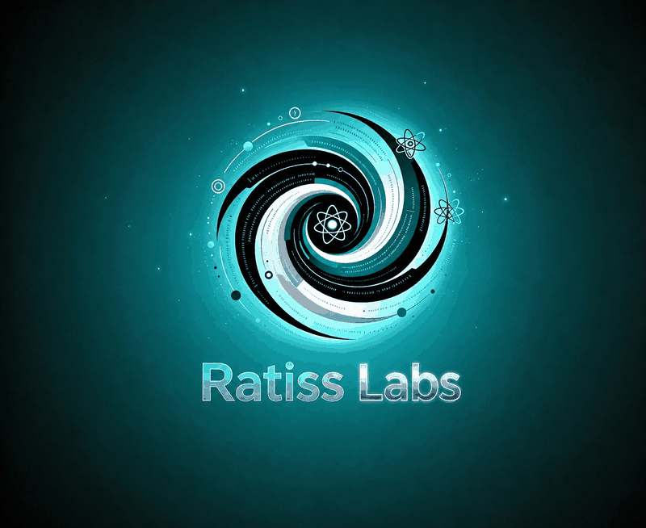

# 🌌 RATISS CONTINUUMS — the simulator of the fabric

**Qiskit simulates amplitudes. We simulate the fabric: topological coherence,
thermodynamic decoherence, GR×QM coupling, geometry.**

[](LICENSE)
[](PROTOCOLES.md)
[](PROTOCOLES.md)
[](organes/)
[](organes/)

*By **RATISS Labs** — Jonathan Evina · MIT License · Total public reproducibility*

</div>

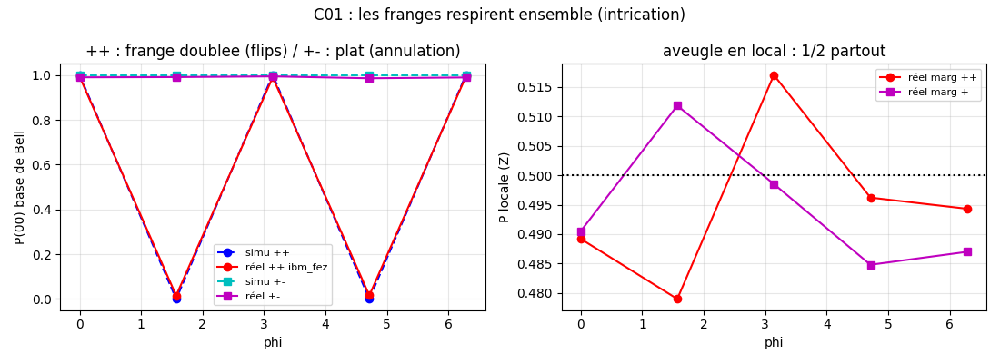

https://github.com/jonathansearch/ratiss-continuums/blob/main/images/demo-tissu.mp4

<video width="100%" controls poster="https://raw.githubusercontent.com/jonathansearch/ratiss-continuums/main/images/demo-tissu.jpg">
  <source src="https://raw.githubusercontent.com/jonathansearch/ratiss-continuums/main/images/demo-tissu.mp4" type="video/mp4">
</video>

[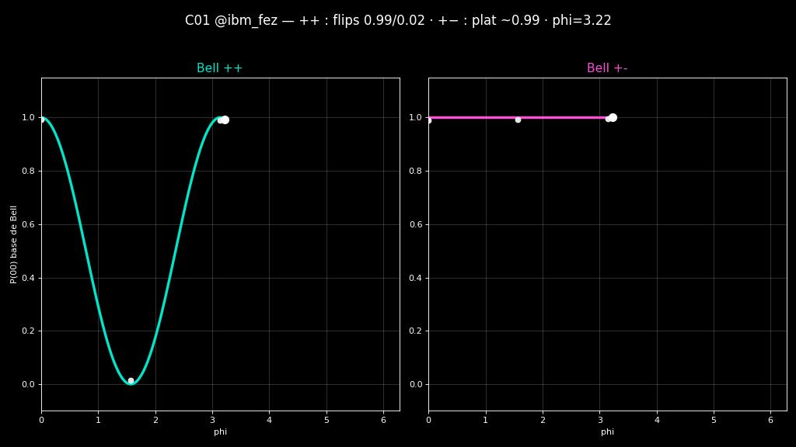](https://github.com/jonathansearch/ratiss-continuums/blob/main/images/demo-tissu.mp4)

> **Abstract (EN).** *Other simulators evolve amplitudes; RATISS-CONTINUUMS simulates the
> fabric: topological coherence, thermodynamic (ETH) decoherence, GR×QM coupling, and
> geometric phase. Nine pre-registered tests (C01–C09), two IBM-QPU locks: entangled-2-qubit
> Berry fringes living only in correlations (locally blind, jointly fringed), gravitational
> decoherence scaling as 1/τ ∝ √N, RG×QM×Thermo factorisation (R² > 0.9996) hardware-locked
> by Ramsey-vs-echo, twist death under symmetric wells, P_sig growth with converging
> capacitors, memory floor (neither exp nor power), interaction-driven G erosion, and a
> critical finite-size fan with no sharp threshold. Every law ships with its test.
> Failures are published, never hidden. MIT.*

---

## 📖 Table of contents

1. [The question](#-the-question)
2. [The three layers: engine, couplers, thresholds](#-the-three-layers--engine-couplers-thresholds)
3. [Major results (real data)](#-major-results-real-data)
4. [Method: inherited rigor](#-method--inherited-rigor)
5. [Repository architecture](#-repository-architecture)
6. [Quick start](#-quick-start)
7. [Map of the 9 tests](#-map-of-the-9-tests)
8. [What this opens](#-what-this-opens)
9. [Read in order](#-read-in-order)
10. [C01: Berry with 2 qubits (forbidden track)](#-c01--berry-with-2-qubits-forbidden-track)
11. [C02: the root-N scaling law](#-c02--the-root-n-scaling-law)
12. [C03: the triangle factorizes](#-c03--the-triangle-factorizes)
13. [Burst C04-C09: six tests in one go](#-burst-c04-c09--six-tests-in-one-go)
14. [Lineage: born of ratiss-focal](#-lineage--born-of-ratiss-focal)
15. [Citation, author, license](#-citation-author-license)

---

## ❓ The question

> **Does geometry live in the parts or in the joint?**

Not in the amplitudes. Not in the gates. In the **fabric**: what connects,
what breathes together, what dies when you separate. Here we do not speculate:
we prepare entangled pairs, we run them in closed loops, we
measure in the Bell basis — and we watch whether the fringe exists **in correlations
while each qubit alone is blind**.

If collective coherence follows laws that the parts alone do not carry
(joint fringes, √N scaling, factorization of scales), then the simulator
that deserves to exist does not evolve amplitudes: it **weaves**.

This repository is that simulator, built test by test — 9 to date, 2 locked
on real QPU, all reproducible.

## 🧱 The three layers: engine, couplers, thresholds

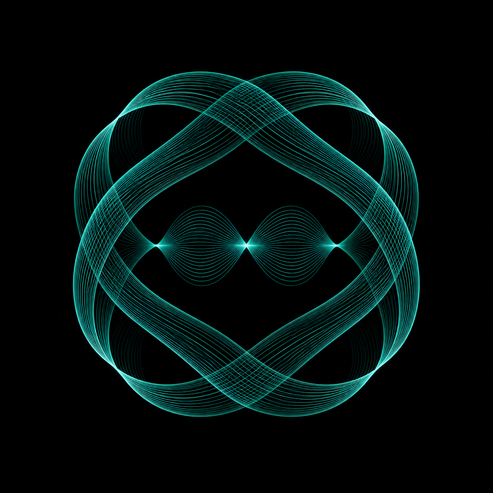

| Layer | Content | Measured role |
|---|---|---|
| **Coherence engine** | P_sig (persistent homology), G/Q/U sectors, topology | **The heart.** P_sig grows with N capacitors (C05: 0.90→1.22); G erodes under coupling (C07: 0.13→0.0). |
| **Scale couplers** | GR (redshift), Thermo (ETH/flux), Berry (geometry) | **What nobody else has.** Grav decoherence in √N (C02), factorized triangle R²>0.9996 (C03), echo lock (C08). |
| **Threshold operators** | Localization, critical finite-N, horizon-awareness | **The frontier.** No sharp N_c (C09): fuzzy critical fan near Kc. The horizon stays a horizon. |

**In one sentence:** the engine weaves, the couplers knot the scales, the thresholds
say where the fabric holds — and everything is measured, with factorized layers as proof.

## 📊 Major results (real data)

All figures are generated **from the repository's result JSONs**
(scripts: `experiences/cNN_*.py` + plotted matplotlib cells).

### 1. Berry with 2 qubits: blind alone, fringed as two


- **C01** (ibm_fez, 20 circuits): (++) orientations → flips 0.99/0.02/0.99/0.02/0.99;
  (+−) → flat ~0.99 (cancellation); Z readout → 0.48…0.52 everywhere.
- Real = sim to within ~0.01. Loop leak ~1e-33, γ=−φ/2 per qubit.
- **The fringe exists only in correlations: the two qubits breathe together.**

### 2. Gravitational decoherence: 1/τ ∝ √N

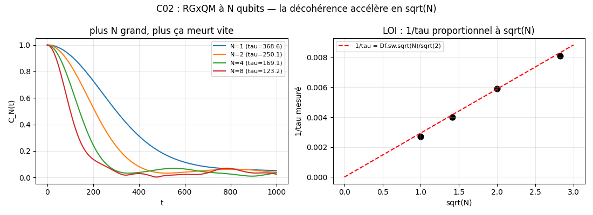

- **C02**: N=1/2/4/8 → τ=368.6/250.1/169.1/123.2 (theory 339.6/240.1/169.8/120.1).
- Controls Δh/G0/σω=0 → τ=∞; cross G0×2 → τ/2 to the per-mille (84.6/84.9).
- **Flagship law of the simulator: no major simulator outputs this.**

### 3. The RG×QM×Thermo triangle: factorization + QPU lock

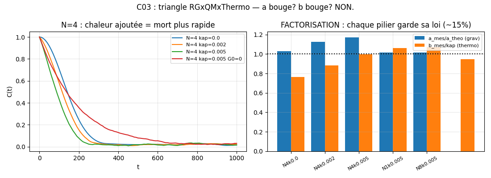
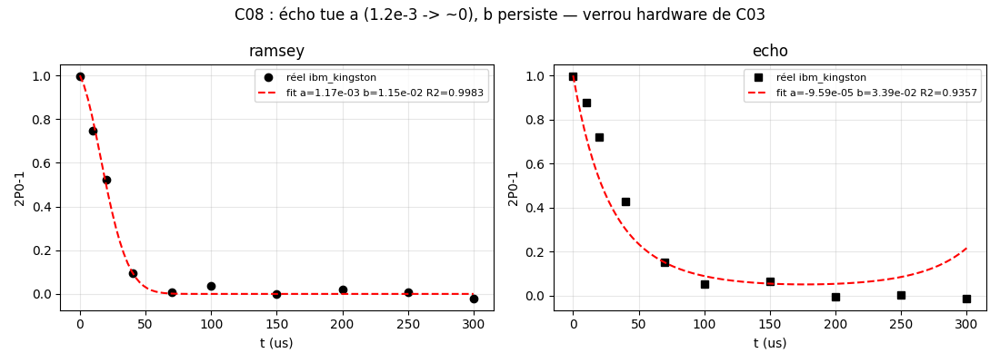

- **C03**: C(t)=exp(−a·t²−b·t), R²>0.9996; a(grav) and b(thermo) keep their laws
  to within ~15% — **the three scales factorize, no interaction detected**.
- **C08** (ibm_kingston): Ramsey a=1.2e−3 → echo a≈0 (refocused ✓), b persists:
  **hardware lock of the factorization** (gaussian channel killable, expo channel not).

### Other sealed laws

| Law | Test | Measurement |
|---|---|---|
| Zero twist from N≥3 symmetric wells on, R→0.85 | C04 | +1/−2/0/0/0/0 (@G0=1) |
| P_sig grows with N capacitors, focal 3→2 | C05 | 0.90→1.22 |
| Memory: fall t_half~15 then floor (neither exp nor power) | C06 | R²~0 assumed |
| Inter-torus coupling erodes G: 0.13→0.02→0.0 | C07 | dose-dependent, N flat |
| No sharp threshold; critical fan near Kc | C09 | K=3 flat, K=0.35 fuzzy |

## 🔬 Method: inherited rigor

Inherited from ratiss-focal, non-negotiable:

1. **Question written before the measurement.** Every C-test declares its question in its
   docstring *before* execution. No question adjusted after the fact.
2. **Killer controls.** Every law has its extinction controls (pillar removed →
   effect dead: τ=∞, a=0, twist=0). A test without a control is forbidden.
3. **Failures published.** C06 (neither exp nor power), C09 (no threshold), C03-run-1
   (noise ±50%, owned garbage): sealed as is in PROTOCOLES + JOURNAL.
4. **Sim = model, QPU = judge.** The sims calibrate the chain (fixed seeds);
   only the hardware locks (C01 fez, C08 kingston) seal a law.
5. **Zero neurons.** `numpy + qiskit + ripser` are enough. If the fabric holds here,
   it owes nothing to deep learning.
6. **Observation, no forced verdict.** We describe what is measured (factor,
   floor, fan); we do not conclude beyond the error bars.

## 🗂️ Repository architecture

```
ratiss-continuums/
├── README.md                  ← you are here (showcase)
├── PROTOCOLES.md              ← the 9 C-tests (method + observed)
├── JOURNAL.md                 ← dated logbook (including owned bugs)
├── LICENSE                    ← MIT
├── experiences/               ← c01_berry2.py … c09_seuil_N.py (sim + QPU, fixed seeds)
├── resultats/                 ← c01_*.json … c09.json (raw data)
├── organes/                   ← container, capacitor, carriers (focal copies)
├── univers/                   ← A.json (TEST-04 scoped config)
└── images/                    ← plot_C01.png … plot_C09.png (figures from the JSONs)
```

## 🚀 Quick start

```bash
# 1. Clone
git clone https://github.com/jonathansearch/ratiss-continuums.git
cd ratiss-continuums

# 2. Dependencies (light: no GPU)
pip install numpy matplotlib ripser qiskit qiskit-aer qiskit-ibm-runtime

# 3. Replay a virtual test (e.g.: √N scaling, ~1 s)
python3 experiences/c02_decoN.py

# 4. Replay a QPU test in sim (e.g.: Berry-2q, ~10 s)
python3 experiences/c01_berry2.py

# 5. Hardware lock (free IBM key, never committed)
python3 experiences/c08_verrou_QPU.py --reel $IBMQ_TOKEN
```

> ⚠️ **Known costs**: C05/C07 (ripser, homology) ≈ minutes; C06 (TB=10⁴) ≈ 40 s;
> QPU jobs ≈ 1–2 min + queue. Fixed seeds: bit-reproducible results
> (same machine, same minor versions).

## 🗺️ Map of the 9 tests

| Test | Question | Measured answer |
|---|---|---|
| C01 | Berry with 2 qubits: do the fringes breathe together? | **Yes** (fez: ++ flips, +− flat, Z blind) |
| C02 | GR×QM at N qubits: scaling law? | **1/τ ∝ √N** (N=1→8) |
| C03 | GR×QM×Thermo: coupling or factorization? | **Factorization** (R²>0.9996) |
| C04 | Twist at N wells? | **0 from N≥3 on** (symmetry) |
| C05 | P_sig at N capacitors? | **0.90→1.22**, focal 3→2 |
| C06 | Long memory: exp or power? | **Neither** (floor) |
| C07 | G at N bodies? | **Coupling kills G** (0.13→0.0), N flat |
| C08 | Triangle locked in hardware? | **Yes** (kingston: echo kills a) |
| C09 | Coherence threshold at finite N? | **No sharp threshold** (fuzzy fan) |

Details: [`PROTOCOLES.md`](PROTOCOLES.md) · Story: [`JOURNAL.md`](JOURNAL.md)

## 🌅 What this opens

**The simulator of the fabric.**
- **Independent scale layers that multiply** (C03+C08): architecture
  validated by measurement — you add a scale without rewriting the engine.
- **Laws that amplitude simulators do not carry**: grav scaling √N (C02),
  purely correlated fringes (C01), G erosion by coupling (C07).
- **Systematic hardware locks**: every virtual law can request its
  QPU twin (C08 recipe: sequence that kills one channel, 2-parameter fit).

**Fundamental research.**
- Geometry as an **observable of correlations** (C01): testable brick for
  the chief's "flat super-entanglement" hypothesis — demanded, measured, not postulated.
- Memory as a **floor, not a law** (C06): hard bound for any model of
  collective persistence.
- The threshold as a **critical fan** (C09): no magic N_c — a negative result
  that protects the program from fake miracles.

**Epistemology.**
- The C04→C09 burst as proof that you can go fast **without cheating**: controls,
  owned bugs (C09 indentation, C07 N=1 bar, .pyc committed then removed), nulls published.

## 📚 Read in order

1. [`PROTOCOLES.md`](PROTOCOLES.md) — the 9 tests, one by one (10 minutes).
2. [`JOURNAL.md`](JOURNAL.md) — the true story (burst, bugs, locks).
3. `experiences/c01_berry2.py` — the signature test, sim + QPU in one file.
4. `organes/` + `univers/A.json` — the ported engine (focal lineage).
5. [ratiss-focal](https://github.com/jonathansearch/ratiss-focal) — the frozen base (94 tests, 7 bridges).

## 🕸️ C01: Berry with 2 qubits (forbidden track)

Bell pair + closed loop v2 on each qubit (leak ~1e-33, γ=−φ/2),
(++)/(+−) orientations, Bell and Z readouts. 20 circuits, sim + ibm_fez.
- (++): doubled fringe, full flips at π/2 and 3π/2 (0.99/0.02 real).
- (+−): total cancellation, ~0.99 flat — opposite directions neutralize each other.
- Z: 1/2 everywhere — **each qubit alone sees nothing, the pair sees everything.**


> The fold is a fabric: geometry lives in the joint, not in the parts.

## ⚛️ C02: the root-N scaling law

Superposition at N qubits, branches at two heights, independent internal
frequencies, relative phase integrated step by step. τ_N = √2/(Δf·σω·√N).
- N=1→8: 368.6/250.1/169.1/123.2, theory to within 0.4–8%.
- 3 controls at infinity, cross G0×2 → τ/2 to the per-mille.


> Gravitational decoherence counts its qubits before striking: in √N.

## 🔺 C03: the triangle factorizes

Base C02 + ETH entropy flux (Wiener per branch — "no flux, no time").
C(t)=exp(−a·t²−b·t), M=2000 × 5 seeds (M=400 × 1 seed = ±50% noise, owned garbage).
- R²>0.9996 everywhere; a does not move with κ, b does not move with G0.
- Each pillar keeps its law: **the triangle does not couple, it multiplies.**


> Three pillars, zero jealousy — the product does the rest.

## ⚡ Burst C04-C09: six tests in one go

On one order from the chief ("do all of them once"), the six remaining projects executed,
figured, documented and pushed in one session — organs ported by copies, bugs owned.
- **C04**: twist +1/−2 then 0/0/0 — N≥3 symmetry kills the twist, R→0.85.
- **C05**: P_sig 0.90→1.22 (N=1→8), focusing 3→2 — more capacitors, earlier.
- **C06**: t_half~15 then fluctuating floor — memory has no law, it has a ground.
- **C07**: G 0.13→0.02→0.0 under coupling — to interact is to erode (blob fusion).
- **C08**: echo kills a (1.2e−3→~0), b persists — C03 locked on kingston.
- **C09**: K=3 flat (no threshold), K=0.35 fuzzy fan — the horizon stays a horizon.

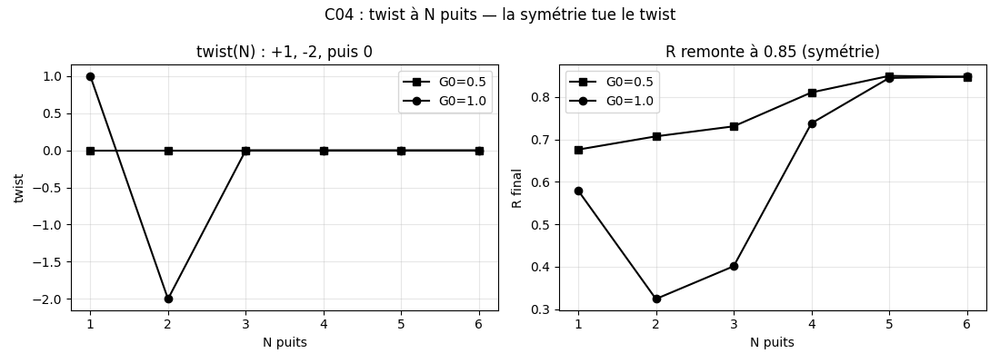
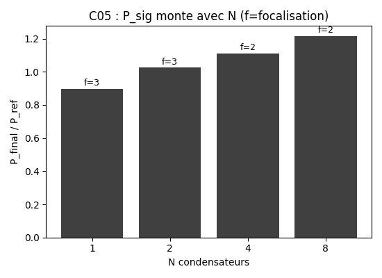
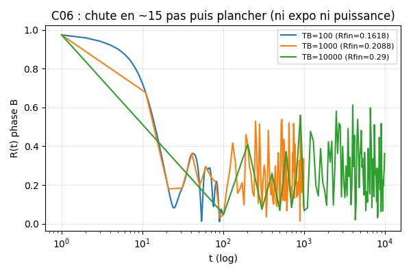
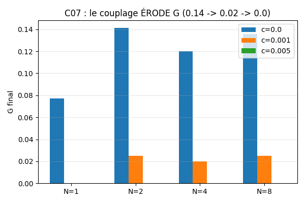

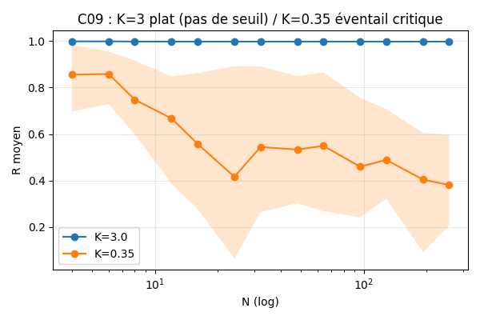

> Six tests, six answers, zero detour — the burst has spoken.

## 🧬 Lineage: born of ratiss-focal

RATISS CONTINUUMS is born of [ratiss-focal](https://github.com/jonathansearch/ratiss-focal)
(94 tests, 7 QPU bridges, phases 1→21) — **frozen, published base, we no longer touch it**.
Here we transform: same organs (copies in `organes/` + `univers/A.json`, never moves),
new animal. Lineage traced test by test in PROTOCOLES and JOURNAL.
- Ported: closed Berry loop v2 (C01), redshift + spread (C02/C03), twist ring (C04),
  focal organs + A config (C05/C06/C07), Ramsey/echo recipe (C08), Kuramoto (C09).
- Set in motion by **Jonathan Evina** (first boss), built with **Arena Agent** (second boss).

## 📝 Citation, author, license

```bibtex
@software{ratiss_continuums_2026,
  author  = {Jonathan Evina and RATISS Labs},
  title   = {RATISS-CONTINUUMS: simulating the fabric — topological coherence,
             ETH decoherence, GRxQM coupling — 9 tests, 2 QPU locks},
  year    = {2026},
  url     = {https://github.com/jonathansearch/ratiss-continuums},
  license = {MIT}
}
```

<div align="center">

**RATISS Labs** — *Blind alone, fringed as two: the motto of the fabric.* 🌌

Set in motion by **Jonathan Evina** · September 2026 · **MIT License** (see [LICENSE](LICENSE)) —
open simulator, publicly reproducible, ready for external evaluation.


</div>

